## 🕷️ Product Web Scraper Using Docker and Helm Charts

### 🚀 Overview

This project is designed to scrape product data from various e-commerce marketplaces using a containerized Docker image. It utilizes Helm charts to dynamically manage and deploy scraping jobs within a Kubernetes environment. The setup demonstrates how Helm can be leveraged to execute distinct scraping tasks in a scalable and repeatable manner.

> **Note:** This project builds upon a previous implementation: [Product Scraper with Docker](https://github.com/codewithbab015/amazon-scraper-dockerized).

#### 🧱 ETL Pipeline Architecture — Multi-Source Scraper on Kubernetes

```mermaid
flowchart LR
    %% External Data Sources
    amazon[("🛒 Amazon<br/>Marketplace")]
    ebay[("🏪 eBay<br/>Marketplace")]
    shopify[("🛍️ Shopify<br/>Stores")]
    
    %% Kubernetes ETL Pipeline
    subgraph k8s ["☸️ Kubernetes Cluster"]
        direction LR

        %% Scraper Job
        job["🐳 Multi-Source Scraper<br/><i>marketplace-scraper</i>"]

        %% ETL Steps
        extract["📥 Extract<br/><i>Product Data</i>"]
        transform["⚙️ Transform<br/><i>Clean & Format</i>"]
        load["📤 Load<br/><i>Save Output</i>"]

        %% Persistent Volume
        storage[("💾 Persistent<br/>Volume")]
        
        job --> extract
        extract --> transform
        transform --> load
        load --> storage
    end

    %% Data Sources to Scraper Job
    amazon --> job
    ebay --> job
    shopify --> job

    %% Styling Classes
    classDef cluster fill:#f8fafc,stroke:#3b82f6,stroke-width:2px
    classDef process fill:#dbeafe,stroke:#2563eb,stroke-width:2px,color:#1e40af
    classDef storage fill:#ecfdf5,stroke:#10b981,stroke-width:2px,color:#047857
    classDef external fill:#f1f5f9,stroke:#64748b,stroke-width:2px,color:#334155

    class k8s cluster
    class job,extract,transform,load process
    class storage storage
    class amazon,ebay,shopify external
```

